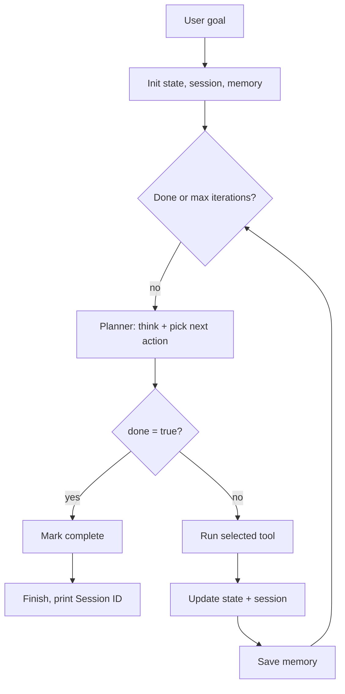

# ADR-001: Agent Harness Architecture

## Status
Accepted

## Context
This project is a minimal, transparent agent runtime for teaching how agent loops work: goal in, planner reasons, one tool executes, state/memory update, repeat until done. No orchestration framework — every moving part is a plain TypeScript module so the loop is fully inspectable.

## Components

### `index.ts` — Entry point
Reads the goal from CLI args (`npm run start -- "<goal>"`) and calls `runHarness(goal)`. Catches and prints errors, exits non-zero on failure.

### `harness.ts` — Loop orchestrator
Owns the `while (!done && iteration < maxIterations)` loop. Each iteration:
1. Registers tools into a fresh `ToolRegistry`.
2. Calls `plan()` to get a `PlannerDecision`.
3. Logs the decision (`thought`, `action`, `arguments`) to the console.
4. If `decision.done` — marks the state complete and stops.
5. Otherwise — executes the chosen tool via `executeTool()`, folds the output into `state`, and appends it to `session`.
6. Persists the iteration snapshot via `saveMemory()`.

Throws if `maxIterations` (default 12) is exhausted before the planner sets `done: true`.

### `state.ts` — Task state
`AgentState = { goal, currentStep, completedSteps, toolOutputs, variables }`. Pure, immutable updates: `createInitialState()` and `updateStateAfterTool()` return new objects rather than mutating. `variables` accumulates anything a tool returns under a `variables` key (e.g. calculator's `lastResult`), giving tools a way to pass data forward without the planner re-deriving it.

### `session.ts` — Conversation log
`AgentSession = { sessionId, conversation, messages }`. Tracks the raw transcript (planner thoughts, tool outputs, user goal) as both a flat string array (`conversation`, fed straight into the planner prompt) and a structured `messages` array. `sessionId` is generated once per run.

### `memory.ts` — Durable audit trail
Appends one JSON line per iteration to `.agent-memory/<sessionId>.jsonl` (iteration number, planner decision, tool output, full state snapshot, timestamp). This is what makes a run replayable/debuggable after the fact — it's a log, not something the planner reads back in-run.

### `planner.ts` — Decision maker
Loads `src/prompts/planner.md` as the system prompt, builds a user prompt from goal + current state (JSON) + conversation transcript + the list of registered tools (name + description), and calls `callResponsesApi()`. Validates the JSON response into a strict `PlannerDecision` shape (`thought`, `action`, `arguments`, `done`) — throws if the model returns anything malformed. This is the only component that talks to the LLM.

### `llm.ts` — Model client
Reads `agent.config.json` for Azure AI Foundry connection info (`azure.endpoint`, `azure.apiKey`, `azure.deployment`, `azure.apiVersion`), constructs an `AzureOpenAI` client, and calls `client.responses.create()` with `temperature: 0`. Strips/extracts a JSON object from the raw model output before returning it as `unknown` — `planner.ts` does the actual shape validation. Config is intentionally file-based (gitignored) rather than hardcoded, so credentials never live in source.

### `toolRegistry.ts` — Tool plumbing
`ToolRegistry` is a `Map<name, ToolDefinition>` with `register/get/list`. `executeTool()` looks up the tool the planner picked by name and runs it, throwing a clear error (with the list of valid tool names) if the planner hallucinates an unknown action.

### `tools/*.ts` — Capabilities
Each tool is a standalone `ToolDefinition = { name, description, run }`:
- **`echo`** — returns input text verbatim; used by the planner to surface a question/message when it's blocked.
- **`calculator`** — evaluates a whitelisted arithmetic expression (regex-gated before `Function()` eval), returns `variables.lastResult` for downstream steps.
- **`readFile`** — reads a file relative to `context.cwd` (or absolute path).
- **`writeFile`** — writes a file, creating parent directories as needed.

Tools only receive `(args, context)` where `context = { cwd }` — no access to state/session/memory directly. All coordination happens through the harness loop.

### `prompts/planner.md` — Planner contract
The system prompt enforcing: pick exactly one tool per turn, return JSON only (no markdown), set `done: true` + `action: "noop"` only when the goal is fully satisfied.

### `agent.config.json` — Runtime credentials
Gitignored. Holds the Azure OpenAI Foundry connection (`endpoint`, `apiKey`, `deployment`, `apiVersion`). `agent.config.example.json` is the checked-in template.

## How the pieces fit together

- **`harness.ts` is the hub** — every other module is a dependency it wires together per-iteration; no module reaches into another except through the types it's handed.
- **`state` vs `session` vs `memory`** are deliberately three different concerns with different lifetimes:
  - `state` = current task snapshot (what the planner reasons over *now*).
  - `session` = full transcript (what the planner reasons over as *history*, fed back in every prompt).
  - `memory` = append-only disk log (what a human reads *after* the run — never read back by the planner).
- **`planner` + `llm`** split "build the prompt / validate the shape" from "talk to the API" — swapping model providers only touches `llm.ts`.
- **`toolRegistry` + `tools/*`** split "how a tool is looked up and invoked" from "what a tool does" — adding a tool means writing one file and one `registry.register()` call in `harness.ts`.

## Flow diagram

## Consequences
- **Pro**: every stage is one small pure-ish function; a learner can trace a run top to bottom without hidden framework magic.
- **Pro**: swapping LLM providers (already done once: OpenAI → Azure AI Foundry) only requires editing `llm.ts` + config shape — `planner.ts` and everything upstream is provider-agnostic (it only knows about `callResponsesApi(system, user) -> unknown`).
- **Con**: no retry/backoff around the LLM call, no streaming, no parallel tool calls — intentional, matches the "transparent teaching tool" goal, not a production agent runtime.
- **Con**: `agent.config.json` holds a raw API key on disk (gitignored but unencrypted) — acceptable for a local teaching project, not for shared/production use.
